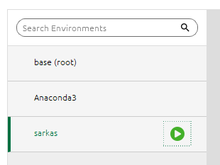

***********
Get Started
***********

It is good practice to create virtual environment for your each of your programming projects. Below are instructions
for creating the ``sarkas`` virtual environment. Otherwise you can jump to the next section and :ref:`install <sec_installation>` Sarkas

.. warning::

    If you are unfamiliar with command line interface we strongly suggest to follow the instructions
    to create a virtual environment via Anaconda Navigator.

Step 1. Virtual Environment
===========================

Anaconda Navigator
------------------
You can create a new environment with python 3.7 using Anaconda Navigator.
Follow the instructions in this `link <https://docs.anaconda.com/anaconda/navigator/getting-started/#managing-environments>`_

Command Line Interface (UNIX systems)
------------------------------------
Open a Terminal and check if you have ``conda`` installed

.. code-block:: bash

    $ which conda

This command will print the path of your ``conda`` binaries. If nothing is printed then you need to install it. 
Visit `Anaconda`_ and download their Python 3.* installer.

You can create a virtual environment via

.. code-block:: bash

    $ conda create --name sarkas python=3.7 pip

This command will create the virtual environment ``sarkas`` with python 3.7 and ``pip`` installed. 
The environment can be found in the ``envs`` directory of your conda directory (the one printed above by the command ``which``). 

Once the environment has been created you can activate it by

.. code-block:: bash

    $ conda activate sarkas

and deactivate it by

.. code-block:: bash

    $ conda deactivate

.. _sec_installation:

Step 2. Installation
====================

Anaconda Navigator
------------------
Once you created the environment you can activate it by clicking on it. Note that an arrow next to the name indicates
that the environment is active. See figure below

Click on the arrow and select `Open in Terminal`. In Terminal you can install sarkas system wide via

.. code-block:: bash

    $ pip install sarkas

Command Line Interface (UNIX systems)
-------------------------------------
Activate the sarkas environment, if not already active, via
you can install sarkas system wide via

.. code-block:: bash

    $ conda activate sarkas

You can now install sarkas system wide via
.. code-block:: bash

    $ pip install sarkas

.. note::

    Unfortunately at the moment Sarkas is available only via PIP. We are working on distributing it via conda.

External packages
-----------------

Sarkas uses two external packages: `FFTW <http://www.fftw.org/>`_ and `FMM3D <https://fmm3d.readthedocs.io/en/latest/>`_ . 
The first is used to perform fast Fourier transforms and the second to simulate systems with open boundary conditions.

FFTW3 is a very commong library in scientific computation, however, it may happen that you don't have it already installed on your computer.
In this case, follow their `instructions <http://www.fftw.org/#documentation>`_ to install it.

FMM3D is package written in Fortran to compute the potential field using the Multipole expansion. The documentation for installing it is `here <https://fmm3d.readthedocs.io/en/latest/install.html>`_.
You can find their `section <https://fmm3d.readthedocs.io/en/latest/install.html#building-python-wrappers>`_ on a Python wrapper.

Known Issues
============

Sarkas contains two matplotlib configuration files,
`MSUstyle <https://raw.githubusercontent.com/murillo-group/sarkas/929f73adfc4539bc6fedc69bf99eb8c7a63fc517/sarkas/mplstyles/MSUstyle.mplstyle>`_
and `PUBstyle <https://raw.githubusercontent.com/murillo-group/sarkas/929f73adfc4539bc6fedc69bf99eb8c7a63fc517/sarkas/mplstyles/PUBstyle.mplstyle>`_.
However, they are not installed by default. Therefore, if you want to use our styles, you need to manually copy
the mpl styles in the correct folder. Here is a sample python script for installing the mpl styles.
Remember to point to the right STYLE_PATH.

.. code-block:: python

    import matplotlib as mpl
    import shutil
    import os
    import glob
    # ~ # ref  ->  matplotlib/style/core
    BASE_LIBRARY_PATH = os.path.join(mpl.get_data_path(), "stylelib")
    STYLE_PATH = "Path of MSUstyle and PUBstyle"
    STYLE_EXTENSION = "mplstyle"
    style_files = glob.glob(os.path.join(STYLE_PATH, "*.%s" % (STYLE_EXTENSION)))

    # Copy the plotting style in the matplotlib directory
    for _path_file in style_files:
        _, fname = os.path.split(_path_file)
        dest = os.path.join(BASE_LIBRARY_PATH, fname)
        shutil.copy(_path_file, dest)
        print("%s style installed" % (fname))

Run the code
============
In the following pages you will find a quickstart notebook to check that Sarkas runs correctly and a long tutorial on how to 
setup and run simulations.

.. toctree::
    :maxdepth: 1

    Tutorial_NB/Quickstart
    tutorial

.. _Anaconda: https://www.anaconda.org
.. _repository: https://github.com/murillo-group/sarkas-repo
.. _fork: https://docs.github.com/en/github/getting-started-with-github/fork-a-repo
.. _clone: https://help.github.com/en/github/creating-cloning-and-archiving-repositories/cloning-a-repository
.. _download: https://www.anaconda.com/products/individual